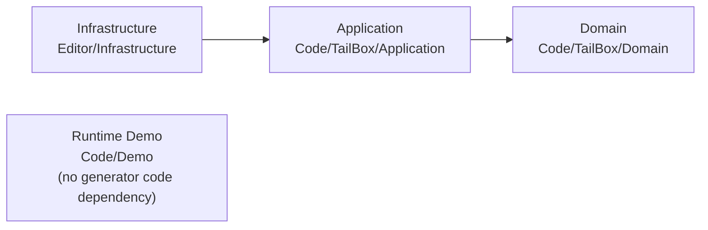
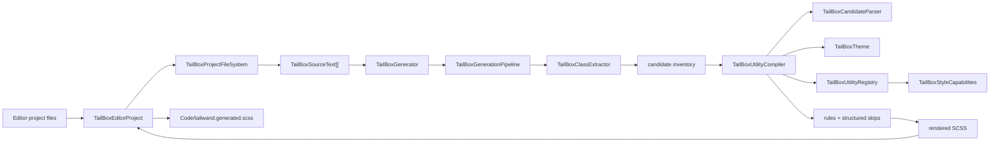

# tailw& Architecture

tailw& is organized as layered code while keeping the public namespace `Sandbox.TailBox` stable:

- `Code/TailBox/Domain`: Tailwind-shaped parsing, theme lookup, utility rules, selector escaping, and s&box style capability decisions. This layer is pure and has no project filesystem access.
- `Code/TailBox/Application`: generation use cases and contracts: config DTOs, source text DTOs, extraction, pipeline orchestration, results, and the public in-memory generator facade.
- `Code/Demo`: optional s&box runtime demo components. This code may depend on scene, camera, screen, mouse, and Razor UI APIs, but it must not be referenced by the generator core.
- `Editor/Infrastructure`: s&box editor integration and raw IO: config file load/save, content glob discovery, Razor file reads, generated stylesheet writes, watcher debounce, and menu actions.

Dependency direction is one-way:

`Code/TailBox` must remain s&box whitelist-safe. Any direct `System.IO` file discovery, file reads, file writes, or editor APIs belong in `Editor/Infrastructure`.

This is enforced by `TailBoxArchitectureTests`: Domain may not reference application contracts or infrastructure, and Application may not reference editor/file infrastructure.

## Pipeline

## Responsibilities

### Domain

`TailBoxCandidateParser`

Turns one raw class string into a Tailwind-shaped candidate. It owns variant splitting, important flags, negatives, slash modifiers, arbitrary values, arbitrary properties, and report-only selector variant classification.

`TailBoxText`

Shared text helpers for Tailwind-compatible splitting, arbitrary value decoding, Tailwind escape parity, and s&box-safe generated selector escaping.

`TailBoxTheme`

Normalizes config dictionaries into Tailwind-like theme buckets and provides token helpers for spacing, colors, arbitrary values, fractions, and negative values.

`TailBoxCompileDiagnostic`

Internal domain diagnostic for a candidate that parsed but cannot be emitted. It does not carry source file context because source paths belong to the application reporting layer.

`TailBoxUtilityRegistry`

Maps parsed candidates to declarations for supported utility families. This is where new utility support should usually be added.

`TailBoxStyleCapabilities`

The final safety gate. It rejects declarations that are outside the verified s&box style property/value subset.

`TailBoxUtilityCompiler`

Coordinates parser, variant gating, theme construction, utility registry lookup, selector escaping, and final s&box capability checks for a single candidate.

### Application

`TailBoxConfig`

Public generation configuration and JSON serialization. Project file load/save is intentionally not implemented here because runtime code must remain whitelist-safe.

`TailBoxThemeFactory`

Application adapter that converts public `TailBoxConfig` data into the domain `TailBoxTheme`. This keeps Domain independent from config serialization and public DTO shape.

`TailBoxScssRenderer`

Application renderer that turns domain utility rules into deterministic SCSS text. Domain rule objects stay as declaration data and do not format generated files themselves.

`TailBoxSourceText`

In-memory source contract used by the pure generator.

`TailBoxClassExtractor`

Finds exact class candidates in Razor source text: static `class="..."`, broad Razor string literals for conditional classes, component `class=` attributes, and `tailbox safelist:` comments.

`TailBoxGenerationPipeline`

The named generation stages:

1. Normalize inputs.
2. Extract class candidates from source text.
3. Merge config safelist entries.
4. Compile each candidate into a utility rule or structured skip.
5. Render deterministic SCSS.
6. Build `TailBoxGenerationResult`.

`TailBoxGenerator`

Small public facade for pure, in-memory generation. Runtime callers should use `GenerateFromSources`. The old project-path methods intentionally throw because project file IO must stay in the editor infrastructure layer.

`TailBoxGenerationResult`

Public result contract with generated class count, deterministic SCSS, structured skipped items, warnings, output path, and write state.

`TailBoxSkippedClass`

Public skipped-item report. The application layer maps domain `TailBoxCompileDiagnostic` values into this type and adds source file context when known.

### Infrastructure

`TailBoxEditorProject`

Editor-only use-case facade between the user's s&box project and the pure generator. It delegates raw file work to `TailBoxProjectFileSystem`, calls `TailBoxGenerator.GenerateFromSources`, and returns write-aware results.

`TailBoxProjectFileSystem`

Editor-only raw IO adapter. It loads/saves `tailwand.config.json`, still recognizes legacy `tailbox.config.json`, applies content globs, ignores generated/build paths, reads Razor files into `TailBoxSourceText`, and writes generated SCSS only when it changed.

`TailBoxEditorWatcher`

Editor-only watcher and debounce loop. It does not understand Tailwind utilities; it only decides when to call `TailBoxEditorProject.Generate`.

`TailBoxEditorMenu`

Editor menu actions for initialize, generate now, and watcher toggling.

### Runtime Demo

`TailBoxDemo`

Scene bootstrap component. When present on a GameObject, it resolves or creates a `ScreenPanel`, creates a main `CameraComponent` only when the scene has no camera, enables mouse UI, and attaches `TailBoxDemoMenu`.

`TailBoxDemoMenu`

Razor `PanelComponent` showcase. It is split into screens for display, flex behavior, position, sizing, spacing, text colors, background colors, borders/radius, typography, overflow, z layering, pointer/cursor, filters, negative values, unsupported reporting, and the current support matrix. It uses tailw& utility classes so the normal generator output powers the demo styling.

## Adding A Utility

1. Add or extend the resolver in `Code/TailBox/Domain/Utilities/TailBoxUtilityRegistry.cs`.
2. Use `TailBoxTheme` helpers for token/arbitrary value resolution.
3. Let `TailBoxUtilityCompiler` run the declaration through `TailBoxStyleCapabilities`.
4. Add a positive utility test and, if relevant, an unsupported reason test.

## Adding A Variant

1. Add classification in `Code/TailBox/Domain/Candidates/TailBoxCandidateParser.cs`.
2. Only emit it in `TailBoxUtilityCompiler` if the generated selector form is verified in s&box.
3. Otherwise return a stable `TailBoxSkipReason` so users see why it did not emit.

## Adding Editor Integration

1. Keep editor/file APIs in `Editor/Infrastructure`.
2. Convert project files into application contracts such as `TailBoxSourceText`.
3. Call `TailBoxGenerator.GenerateFromSources`.
4. Keep generated output writes behind `TailBoxProjectFileSystem.WriteIfChanged`.
